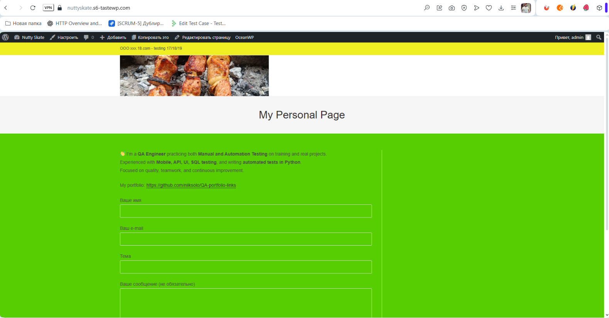
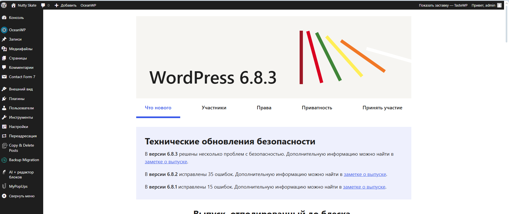

# 🌟 CMS WordPress Site Test 🌟

This project was created for learning and practicing QA on CMS systems.  
For learning, I chose **WordPress**, installed the site locally, customized it for myself, and created **test documentation**.

## 🔍 What I studied and did:
- 🖥 Worked with the **WordPress admin panel**
- 📄 Created and tested pages and forms
- ✅ Tested the site through **UI, functionality, API, and database**
- 🔒 Performed basic security tests (SQL injection, form validation)
- 📝 Collected and organized test cases and a checklist  

---

## 📸 Screenshots
  
  