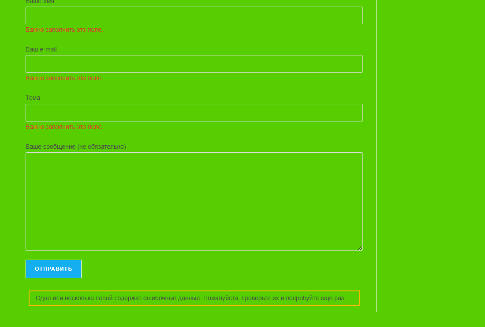

# TC-002: Submit contact form with all fields empty

**Preconditions:**  
Open main page (contact form visible).

**Steps:**  
1. Leave **Ваше имя** empty  
2. Leave **Ваш e-mail** empty  
3. Leave **Тема** empty  
4. Leave **Ваше сообщение (не обязательно)** empty  
5. Click **Submit**

**Expected Result:**  
- Form does not submit.  
- Validation messages appear for required fields.  
- No 500 error or site crash.

**Status:** `Pass`  

**Attachments:**  
  