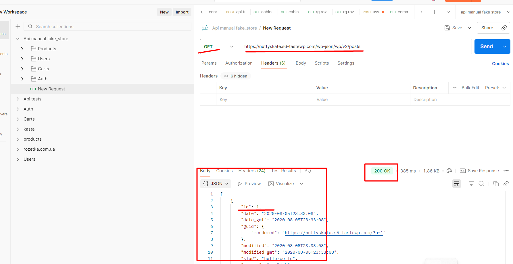

# TC-005: Check GET /posts

**Preconditions:**  
- Postman is installed or accessible.  
- Site is running and reachable (e.g., http://nuttyskate.s6-tastewp.com).  

**Steps:**  
1. Open Postman.  
2. Create a new **GET** request to `/wp-json/wp/v2/posts`.  
3. Send the request.  
4. Check response.

**Expected Result:**  
- Status code is `200 OK`.  
- Response is valid JSON.  
- At least one post is returned with correct fields (`id`, `title`, `content`).  

**Status:** `Pass`  

**Attachments:**  
  