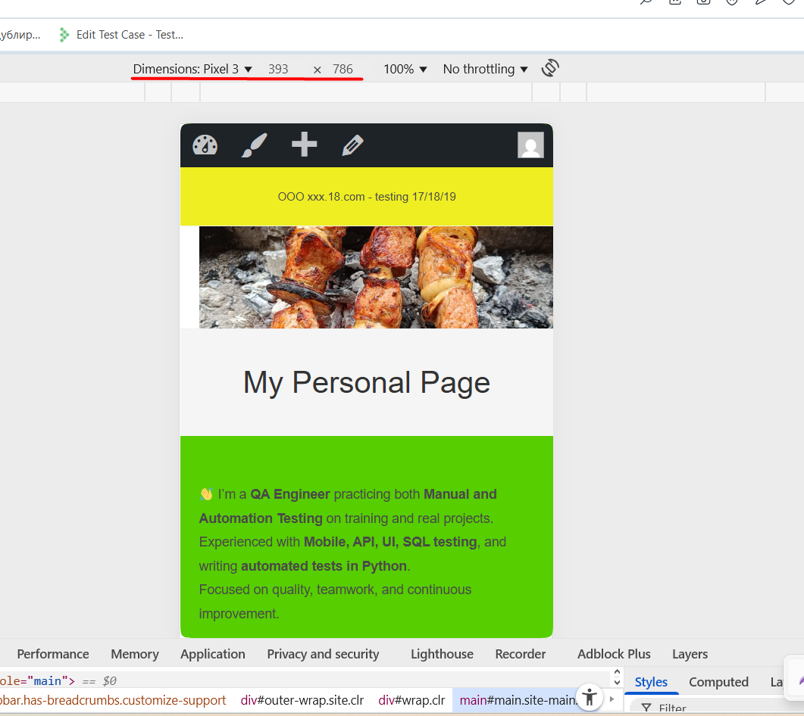

# TC-004: Check mobile view of the site

**Preconditions:**  
- Open the site in a browser.  
- DevTools is open.  

**Steps:**  
1. Open DevTools (`F12`).  
2. Enable **Device Toolbar**.  
3. Select a mobile device (e.g., Pixel 3).  
4. Refresh the page if needed.  
5. Check that all elements display correctly:  
   - Header, banner, navigation menu.  
   - Contact form and links.  
   - Buttons, images, texts, and info blocks.  

**Expected Result:**  
- All site elements display correctly on the chosen mobile device.  
- No horizontal scroll (page fits screen).  
- Buttons and links are clickable and work correctly.  

**Status:** `Pass`  

**Attachments:**  
  