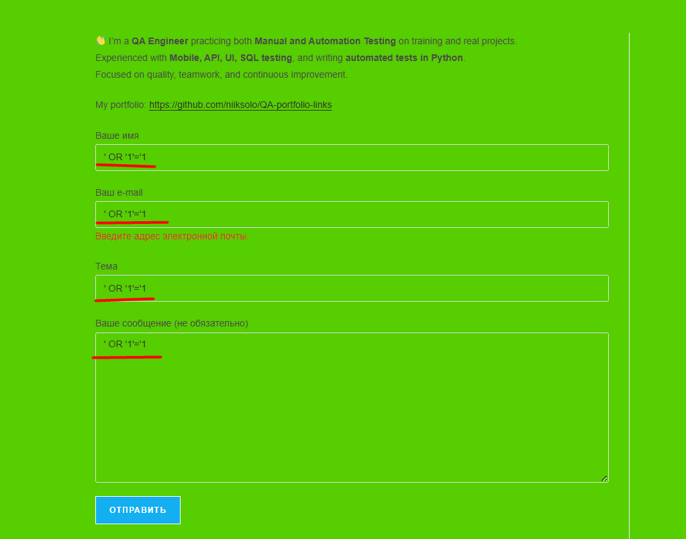

# TC-001: Try SQL injection in contact form

**Preconditions:**  
Open main page (contact form visible).  

**Steps:**  
1. Fill **Ваше имя**: `' OR '1'='1`  
2. Fill **Ваш e-mail**: `' OR '1'='1`  
3. Fill **Тема**: `' OR '1'='1`  
4. Fill **Ваше сообщение (не обязательно)**: any text or leave empty  
5. Click **Submit**  

**Expected Result:**  
- Form rejects or sanitizes SQL payloads.  
- No SQL error or stack trace visible to the user.  
- Site does not crash (no 500).  
- If front-end validation blocks input (e.g. invalid email) — acceptable, but server must also validate/sanitize input.  

**Status:** `Pass`  

**Attachments:**  
  