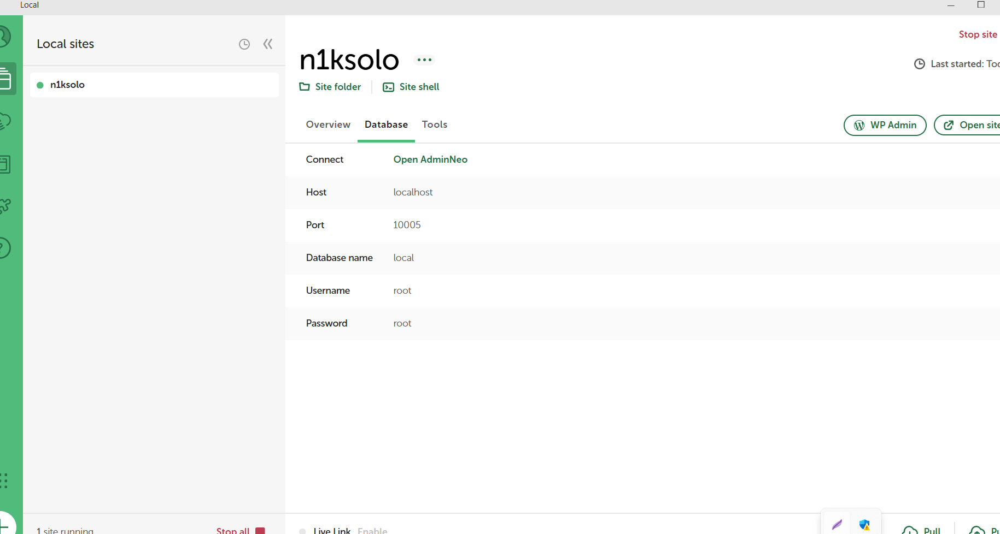
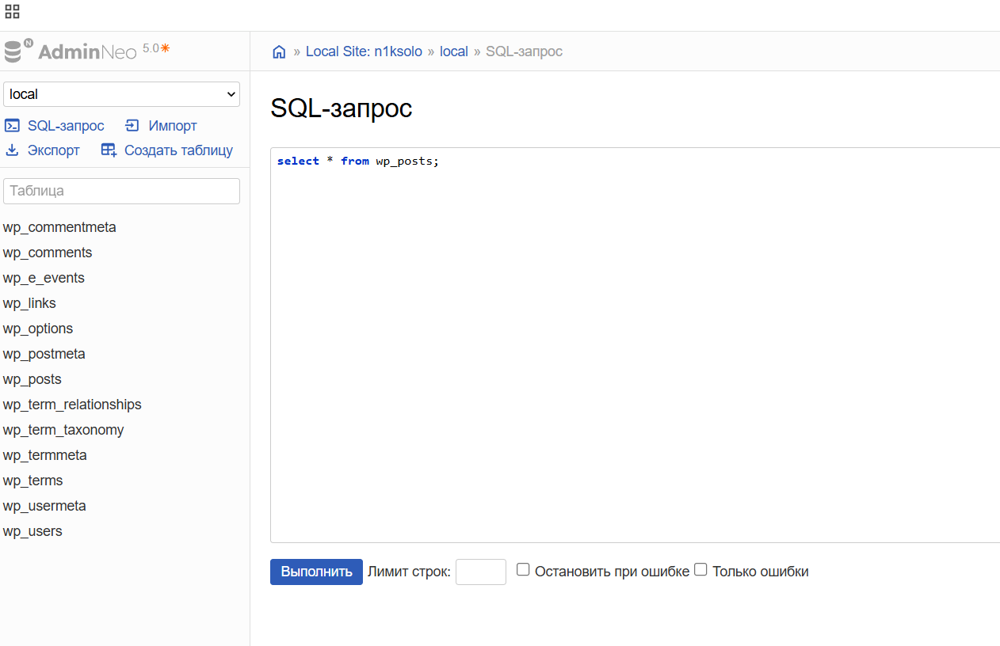
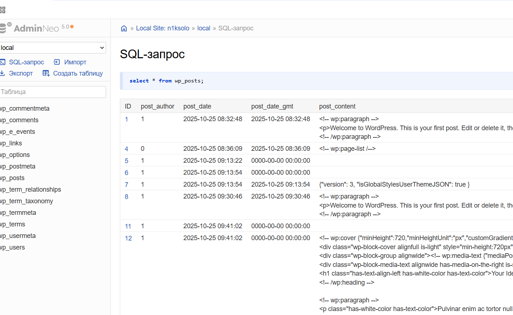

# TC-003: Verify posts in WordPress database  

**Preconditions:**  
- Access to the WordPress database  Open Admin Neo.  
- Test post exists in WordPress admin.  

**Steps:**  
1. Open `Open Admin Neo`.  
   
2. Connect to the WordPress database.  
3. Execute SQL query: `SELECT * FROM wp_posts;`  
   
4. Check that the recently created test post appears in the results.  
  

**Expected Result:**  
- Test post is visible in the query results.  
- All post fields (title, content, status, author) match what was entered in the admin panel.  
- No database errors or connection issues occur.  

**Status:** `Pass`  
